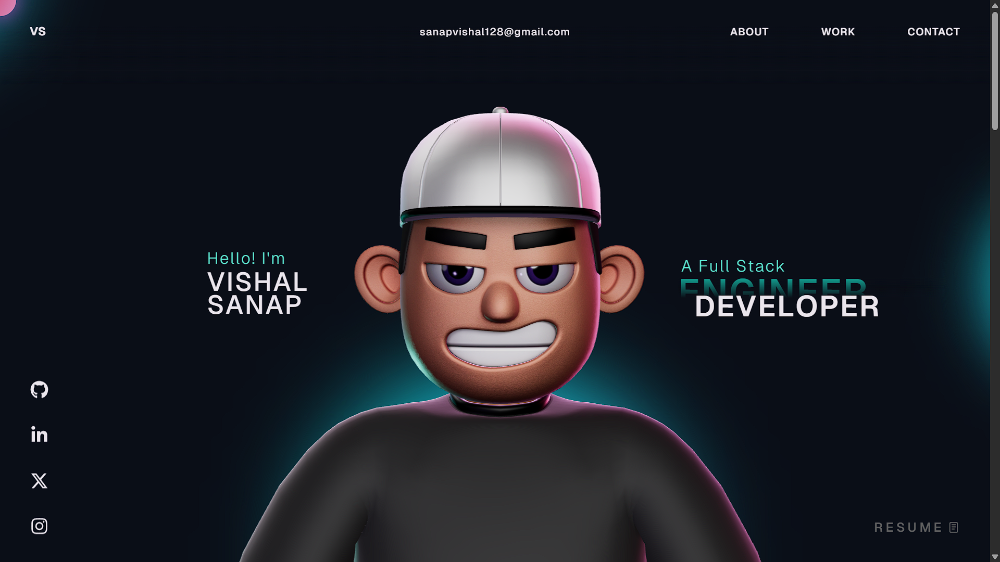

<h1 align="center">Hi 👋, I'm Vishal Sanap</h1>
<h3 align="center">Full Stack Developer | React Developer | Computer Engineer</h3>

<p align="center">
  <a href="https://vishalsanapdev.onrender.com/" target="_blank">
    
  </a>
</p>

---

# 🚀 My Portfolio Website

This repository contains the **open source version of my personal portfolio website**.
The website showcases my **projects, skills, experience, and development work** in an interactive and visually engaging format.

🔗 **Live Website:**
👉 https://vishalsanapdev.onrender.com/

---

# 🎬 Portfolio Preview

<p align="center">
  
</p>

---

# 🛠️ Tech Stack

<p align="center">


</p>

**Technologies Used**

* React
* TypeScript
* GSAP Animations
* ThreeJS
* WebGL
* HTML5
* CSS3
* JavaScript

---

# ✨ Features

✔ Modern UI / UX Design
✔ Smooth Animations using GSAP
✔ Interactive 3D Elements with ThreeJS
✔ Fully Responsive Design
✔ Fast Performance
✔ Deployed on Render

---

# ⚙️ Installation & Setup

Follow these steps to run the project locally.

### 1️⃣ Clone the Repository

```bash
git clone https://github.com/YOUR_USERNAME/YOUR_REPO_NAME.git
```

### 2️⃣ Navigate to Project

```bash
cd YOUR_REPO_NAME
```

### 3️⃣ Install Dependencies

```bash
npm install
```

### 4️⃣ Run the Development Server

```bash
npm run dev
```

---

# 📦 GSAP Plugins Note

This project uses **GSAP Club Plugins**.

Trial plugins are used for development purposes.
To host the project with full GSAP functionality, you need an official GSAP Club license.

Learn more here:
https://gsap.com/docs/v3/Installation/

---

# 📬 Connect With Me

<p align="center">

<a href="https://vishalsanapdev.onrender.com/">

</a>

<a href="https://github.com/itxzmevishal">

</a>

<a href="https://www.linkedin.com/in/vishal-sanap-/">

</a>

</p>

---

⭐ If you like this project, consider giving it a **star on GitHub**!
